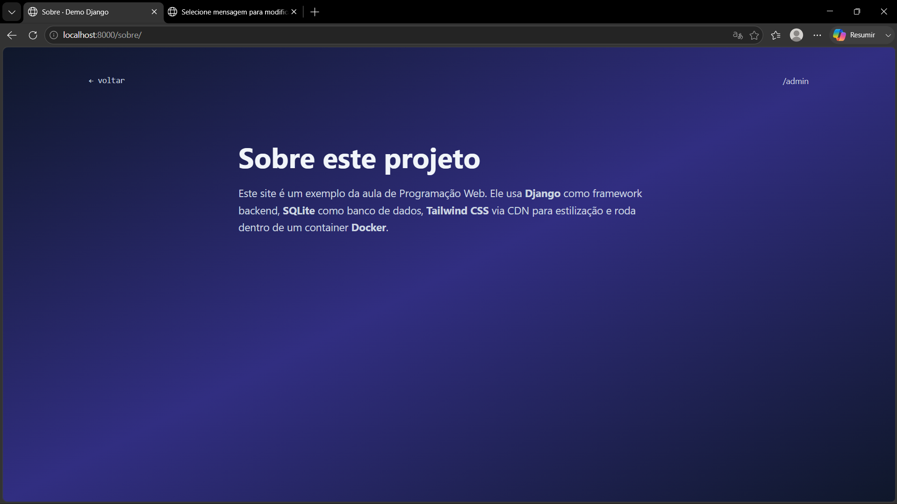

## 🛠️ Tecnologias utilizadas

<p align="center">
  
  
  
  
</p>


## 🖥️ Página inicial

<p align="center">
  
</p>

<p align="center">
  <em>Página inicial do projeto com o tema visual modificado (gradiente em tons de esmeralda/teal).</em>
</p>

## 📝 Cadastro de mensagem no admin

<p align="center">
  
</p>

<p align="center">
  <em>Formulário de cadastro de mensagem no painel administrativo, com o campo <code>autor</code> adicionado.</em>
</p>

## ℹ️ Página Sobre

<p align="center">
  
</p>

<p align="center">
  <em>Nova página <code>/sobre/</code> criada com informações sobre o projeto.</em>
</p>

## ▶️ Como executar o projeto

```bash
git clone 
cd demo-django
docker compose up --build
```

Acesse **http://localhost:8000** no navegador.

## 🔑 Acesso ao admin

Após criar o superusuário, acesse **http://localhost:8000/admin/** para gerenciar as mensagens.

## 📋 Funcionalidades implementadas

- **Página inicial** com listagem de mensagens do banco de dados SQLite
- **Tema visual** modificado com gradiente em tons de esmeralda/teal
- **Campo `autor`** adicionado ao modelo `Mensagem`
- **Página `/sobre/`** com informações estáticas sobre o projeto
- **Painel administrativo** do Django para gerenciar o conteúdo