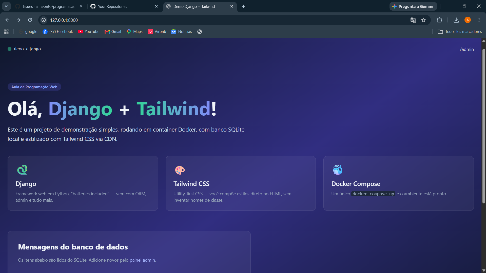

## 🛠️ Tecnologias utilizadas

<p align="center">
  
  
  
  
</p>


## 🖥️ Site em execução

<p align="center">
  
</p>

<p align="center">
  <em>Página inicial do projeto rodando localmente em <code>http://localhost:8000</code></em>
</p>

## ▶️ Como executar o projeto

```bash
git clone 
cd demo-django
docker compose up --build
```

Acesse **http://localhost:8000** no navegador.
